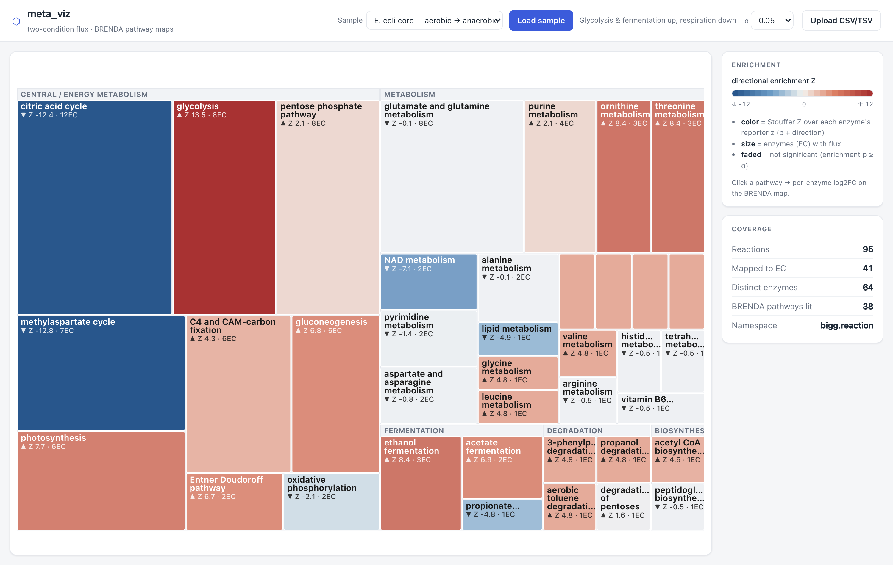
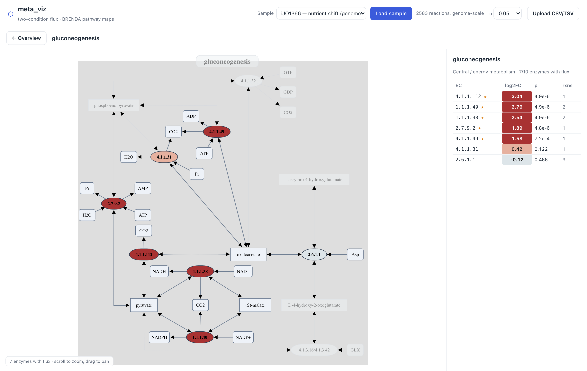

# meta_viz

A web platform for visualizing **two-condition metabolic flux** on the real
[BRENDA pathway maps](https://www.brenda-enzymes.org/pathway_index.php), with
semantic zoom.

- **Zoomed out** — a pathway-category treemap: each BRENDA pathway is colored by a
  directional **enrichment** statistic — Stouffer's Z over its enzymes' reporter
  z-scores (each enzyme's p-value converted to a z, signed by its log2FC direction),
  which gives an enrichment p-value. Sized by the number of enzymes with flux, and
  faded when the enrichment isn't significant (p ≥ α).
- **Zoomed in** — click a pathway to open the actual **BRENDA SVG pathway map**,
  with enzyme boxes recolored by per-enzyme **log2FC** (red up / blue down). A side
  panel lists each enzyme (EC) with its log2FC / p-value / contributing reactions.

Your flux is keyed by **BiGG reaction id** and joined to BRENDA's EC-keyed enzyme
boxes through the bridge `BiGG → MNXR (MetaNetX) → kegg.reaction → EC (KEGG)`.
It is a fully **client-side static app** (no backend), deployable anywhere static.




## Input format

A CSV/TSV with one row per reaction. Required columns (header aliases accepted):

| column | required | aliases |
|---|---|---|
| `reaction_id` | ✅ | `reaction`, `rxn`, `id` |
| `log2fc` | ✅ | `log2FoldChange`, `lfc` |
| `p_value` | ✅ | `pvalue`, `padj`, `qvalue`, `fdr` |
| `flux_cond1`, `flux_cond2` | optional | (informational) |

Reaction ids are **BiGG**-style (e.g. `PYK`, `R_PYK`). You bring the differential
analysis (FBA/pFBA/sampling + your stats); meta_viz maps it onto BRENDA maps.
Reactions without an EC (transport, exchange, spontaneous) don't appear on the maps.

## Develop

```bash
npm install
# one-time data build (needs network): downloads BRENDA SVGs + composes BiGG→EC
npm run data:brenda
npm run dev            # http://localhost:5173

npm test               # unit tests (parsing, EC aggregation, enrichment)
npm run build          # static bundle -> dist/
npm run preview        # serve the built bundle on :4173
npm run test:e2e       # headless money-path test (preview must be running)
npm run test:visual    # multi-scenario screenshot capture -> ./temp_figures/
```

To regenerate the example datasets from scratch: `bash scripts/fetch_models.sh`
(downloads BiGG models) then `npm run data:sample`.

## Architecture

```
public/brenda/                 (generated by npm run data:brenda — gitignored)
  maps/pw_*.svg                193 BRENDA pathway SVGs (CC BY 4.0, BRENDA)
  pathways.json               [{name, file, category, ecs[], nBoxes}]
  bigg2ec.json                { biggReactionId: [EC,...] }  (filtered to BRENDA ECs)
public/data/samples/*.csv      example differential datasets
src/
  io/         parse + validate CSV/TSV, namespace detection
  enrichment/ reporter z-scores + Stouffer pathway enrichment (overview);
              significance-weighted mean log2FC for reaction→EC aggregation
  brenda/     ecMap (flux→EC→pathway), PathwayTreemap (overview),
              BrendaMapView (SVG recolor + zoom), PathwayPanel (EC table)
  overview/   diverging color
  state/      Zustand store
scripts/
  build_brenda_index.py        BRENDA SVGs + reac_xref + KEGG  → public/brenda/
  make_sample_dataset.py       BiGG models → example datasets
reac_xref.tsv                  MetaNetX/MNXref v4.5 (77 MB, gitignored; data:brenda fetches it)
```

The detail layer renders BRENDA's own SVG and recolors only the enzyme (`nodeEN`)
boxes — it does **not** reuse the GPL-3.0 MetaboMAPS engine, so the project stays
permissively licensed. BRENDA hides the detailed enzyme layer by default (shown on
zoom); `BrendaMapView` reveals it, drops the simplified node, and fits the viewBox
to the content.

## License notes

- BRENDA pathway maps — CC BY 4.0 (BRENDA / MetaboMAPS); attribute BRENDA.
- `reac_xref.tsv` — MetaNetX/MNXref, CC-BY-4.0 (build input).
- KEGG reaction→EC associations are factual EC classifications used at build time.
- Example datasets are synthetic; BiGG models (build inputs) are from the BiGG project.
